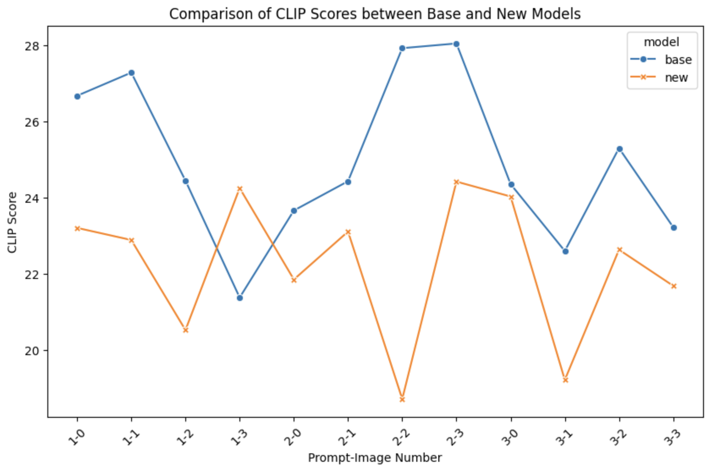
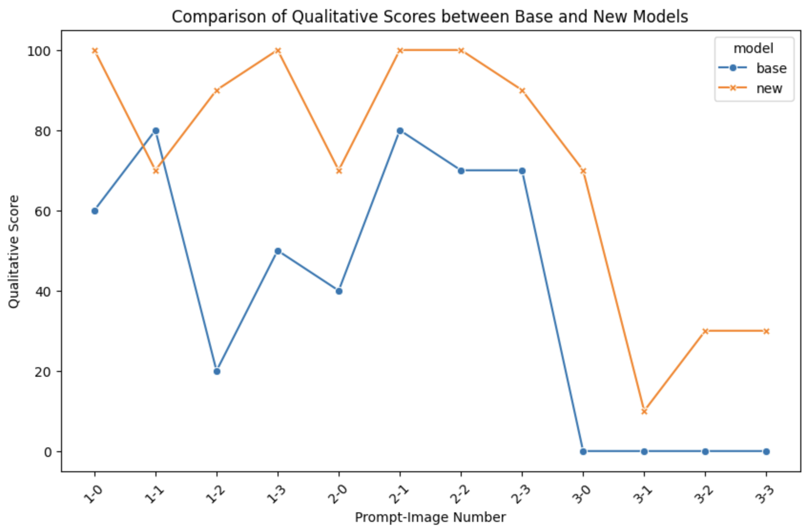

### Stable Diffusion Model Evaluation

#### Data

Table shows the CLIP score and qualitative score for the base model and new model (using LoRA):

| prompt_num | prompt                                           | model | image_num | image_file       | CLIP_score | qual_score |
|------------|--------------------------------------------------|-------|-----------|------------------|------------|------------|
| 1          | square and red perfume bottle with a silver top  | base  | 0         | base_1_0.png     | 26.6795    | 60         |
| 1          | square and red perfume bottle with a silver top  | base  | 1         | base_1_1.png     | 27.2872    | 80         |
| 1          | square and red perfume bottle with a silver top  | base  | 2         | base_1_2.png     | 24.4519    | 20         |
| 1          | square and red perfume bottle with a silver top  | base  | 3         | base_1_3.png     | 21.3856    | 50         |
| 1          | square and red perfume bottle with a silver top  | new   | 0         | new_1_0.png      | 23.2132    | 100        |
| 1          | square and red perfume bottle with a silver top  | new   | 1         | new_1_1.png      | 22.8953    | 70         |
| 1          | square and red perfume bottle with a silver top  | new   | 2         | new_1_2.png      | 20.5329    | 90         |
| 1          | square and red perfume bottle with a silver top  | new   | 3         | new_1_3.png      | 24.2568    | 100        |
| 2          | round and blue perfume bottle with a gold top    | base  | 0         | base_2_0.png     | 23.6694    | 40         |
| 2          | round and blue perfume bottle with a gold top    | base  | 1         | base_2_1.png     | 24.4374    | 80         |
| 2          | round and blue perfume bottle with a gold top    | base  | 2         | base_2_2.png     | 27.9284    | 70         |
| 2          | round and blue perfume bottle with a gold top    | base  | 3         | base_2_3.png     | 28.0522    | 70         |
| 2          | round and blue perfume bottle with a gold top    | new   | 0         | new_2_0.png      | 21.8589    | 70         |
| 2          | round and blue perfume bottle with a gold top    | new   | 1         | new_2_1.png      | 23.1169    | 100        |
| 2          | round and blue perfume bottle with a gold top    | new   | 2         | new_2_2.png      | 18.7234    | 100        |
| 2          | round and blue perfume bottle with a gold top    | new   | 3         | new_2_3.png      | 24.4277    | 90         |
| 3          | curvy and green perfume bottle with a wood top   | base  | 0         | base_3_0.png     | 24.3611    | 0          |
| 3          | curvy and green perfume bottle with a wood top   | base  | 1         | base_3_1.png     | 22.6067    | 0          |
| 3          | curvy and green perfume bottle with a wood top   | base  | 2         | base_3_2.png     | 25.3051    | 0          |
| 3          | curvy and green perfume bottle with a wood top   | base  | 3         | base_3_3.png     | 23.232     | 0          |
| 3          | curvy and green perfume bottle with a wood top   | new   | 0         | new_3_0.png      | 24.0364    | 70         |
| 3          | curvy and green perfume bottle with a wood top   | new   | 1         | new_3_1.png      | 19.2236    | 10         |
| 3          | curvy and green perfume bottle with a wood top   | new   | 2         | new_3_2.png      | 22.6412    | 30         |
| 3          | curvy and green perfume bottle with a wood top   | new   | 3         | new_3_3.png      | 21.6934    | 30         |

#### Plot

Here is the plot of the base vs new model using the CLIP score:

Here is the plot of the base vs new model using the qualitative score:

#### Source

CLIP score source: https://huggingface.co/docs/diffusers/en/conceptual/evaluation