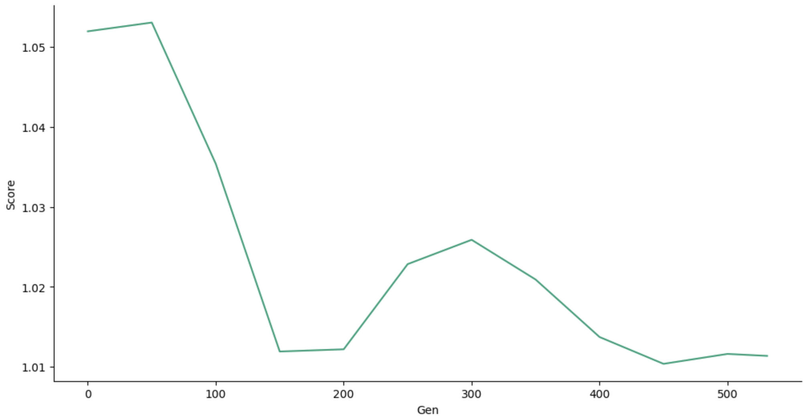

### StyleGAN Model Evaluation

#### Data

The inception score was calculated for the following model generations:

| Generation | Score |
|-----|--------------|
| 0   | 1.051980888  |
| 50  | 1.05307944   |
| 100 | 1.035402334  |
| 150 | 1.01191129   |
| 200 | 1.012187169  |
| 250 | 1.02284737   |
| 300 | 1.025890163  |
| 350 | 1.02092048   |
| 400 | 1.013723214  |
| 450 | 1.01036681   |
| 500 | 1.01160848   |
| 531 | 1.011361886  |

#### Plot

Here is the plot of model generation vs inception score:

#### Source

Inception score source: https://github.com/sbarratt/inception-score-pytorch